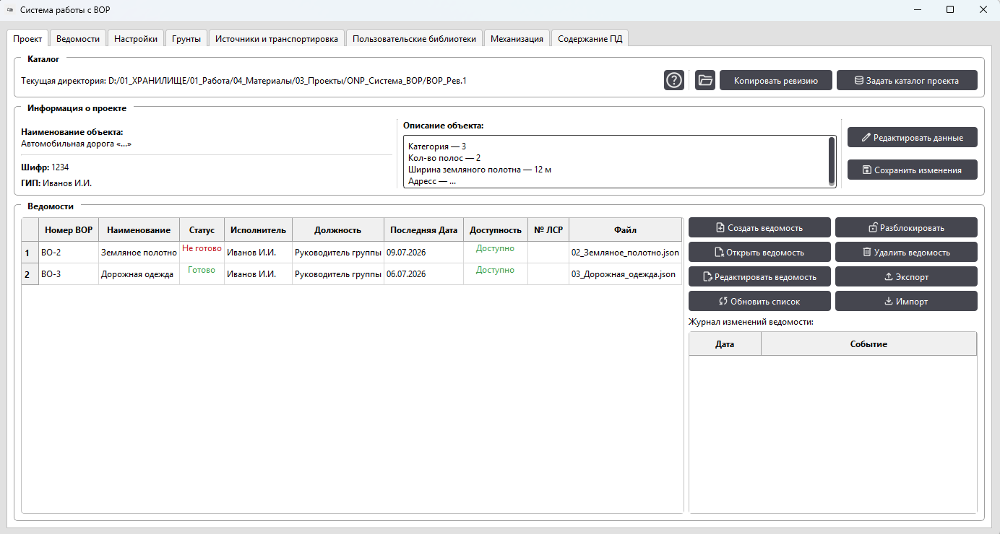
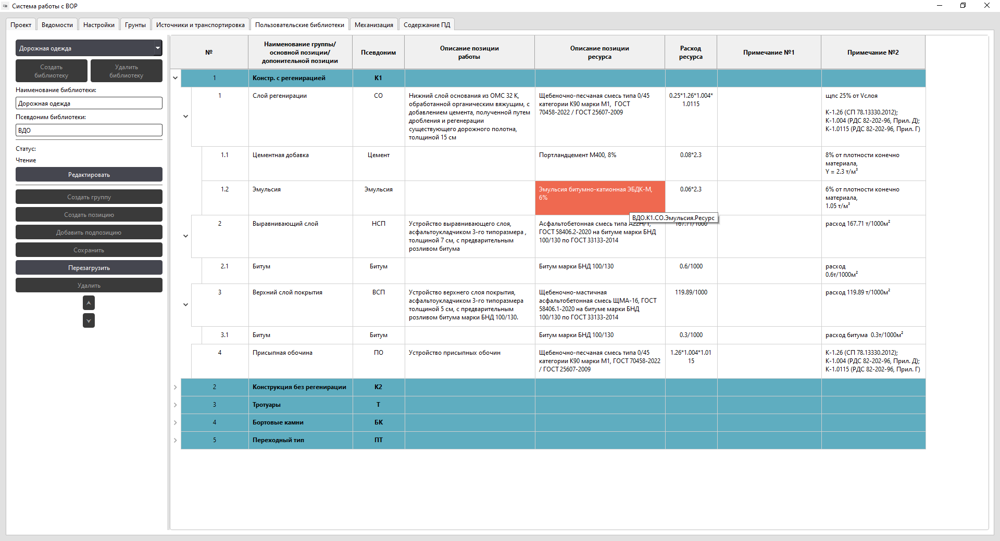
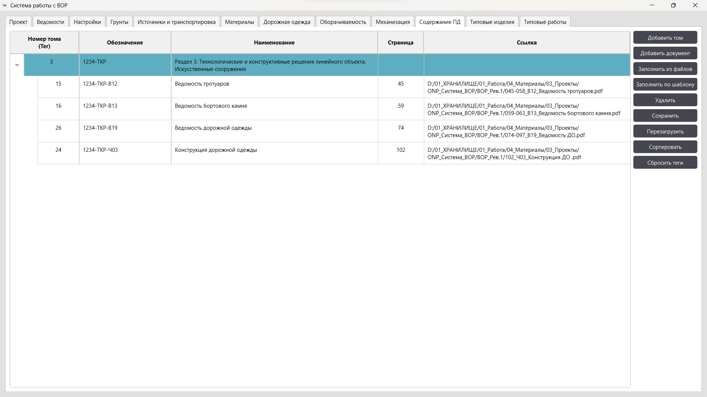
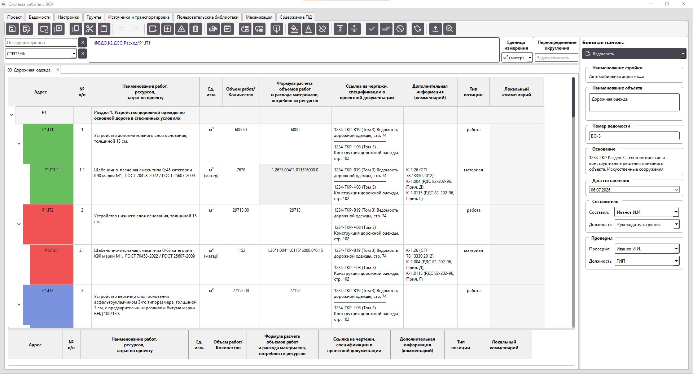
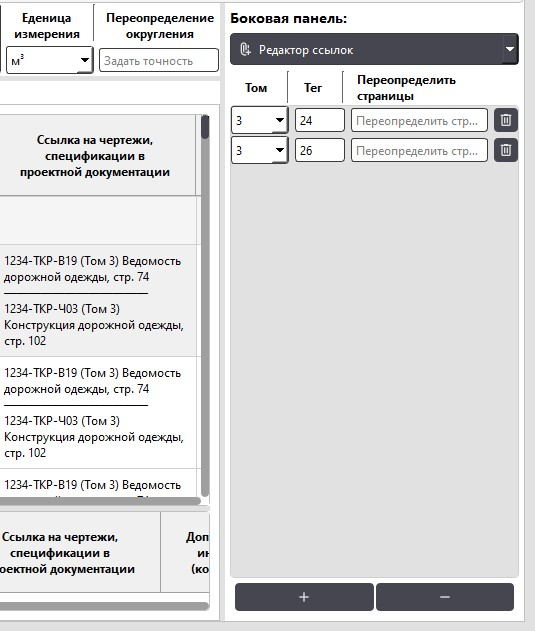

# ONP: Система ВОР

> [!NOTE]
> This project is tailored to Russian construction design workflows and holds little practical value internationally. 
> All documentation and code comments are in Russian only.

Данный проект разработан для автоматизации и упрощения формирования ведомостей объемов работ (ВОР) в соответствии с XML-схемой Минстроя ([QuantityTakeoff-3_01.xsd](https://www.minstroyrf.gov.ru/tim/xml-skhemy/vedomost-obemov-rabot/p11_1/)) с акцентом на применение в дорожно-строительной области.

Функционал программы разрабатывался с учётом опыта участия автора в прохождении экспертизы, отработки замечаний экспертов и призван облегчить этот процесс.

**ONP: Система ВОР** предлагает следующие возможности:
- формирование ВОР в виде иерархической таблицы данных (Раздел → Основная позиция работы → Ценообразующий ресурс);
- построение зависимостей между позициями подобно Excel;
- создание и использование библиотек данных для динамического связывания позиций ведомостей и их автоматического обновления;
- автоматизированное создание позиций ВОР на основе шаблонов библиотек;
- индикация статусов позиций ведомостей, отслеживание готовности и проблем;
- упрощённую систему создания ссылок на проектную документацию;
- функционал для логирования информации о изменениях в файлах;
- пакетный экспорт ведомостей в формате `.xml`/`.gge`, а также PDF печать с автоматизированной простановкой закладок;
- импорт ведомостей из форматов `.xml`/`.gge`, а также ограниченный импорт из файлов Excel (`.xlsx`/`.xlsm` по форме импорта для КПСР);
- простой и открытый формат хранения рабочих данных в виде JSON-файлов;
- полная независимость от интернета для работы, отслеживание занятости файлов при работе на локальном сервере.

### Кому это может быть полезно

Программа разрабатывалась с прицелом на малые проектные группы и организации, не обладающие финансовыми возможностями приобрести лицензию на ПО под каждую задачу.

Также, с учётом дорожной карты по переходу строительной отрасли на отечественное ПО, эта программа сможет предложить альтернативу в вопросе формирования ВОР (по крайней мере на это надеется автор).


## Демонстрация

Подробная информация по использованию программы приведена в [руководстве пользователя](ONP_Система_ВОР.%20Руководство.pdf).

Для ознакомления с системой в репозитории приложен каталог «Пример_каталог_ВОР», который следует открыть с помощью программы.

Ниже представлены некоторые основные функциональные элементы.

#### Рабочее окно программы

<p align="center">

</p>

В данном окне осуществляется работа с данными проекта, расположенными в соответсвующих вкладках.
В стартовой вкладке «Проект» осуществляется настройка текущей рабочей директории, указываются основные сведения по проекту.
Также тут расположен перечень всех существующих файлов ведомостей объемов работ и функционал по взаимодействию с ними.

#### Вкладка «Пользовательские библиотеки»

<p align="center">

</p>

Данная вкладка позволяет пользователям создавать собственные библиотеки данных для последующего автоматизированного формирования позиций _ВОР_.

Например, пользователь может создать список элементов с информацией о часто используемых материалах в проекте или библиотеку с дорожными конструкциями.

#### Вкладка «Содержание ПД»

Вкладка предназначена для управления составом проектной документации (томов и документов) и позволяет создавать структуру томов, добавлять документы, присваивать им страницы, шифры и привязывать файлы. 

<p align="center">

</p>

Данные используются для автоматизированного формирования ссылок (столбец «_Ссылка на чертежи, спецификации в проектной документации_»).
Ввиду того, что на момент формирования _ВОР_ структура раздела ПД зачастую не завершена и конечное количество страниц неизвестно, используются теги для документов.
Для каждого документа создаётся уникальный тег, не зависящий от порядкового расположения в томе, с помощью которого в дальнейшем система получает актуальную информацию о документе.

#### Вкладка «Ведомости»

Основная вкладка для работы с файлами _ВОР_. 
Может содержать несколько открытых файлов.

<p align="center">

</p>


Вкладка работы с файлами ведомостей имеет следующие области:
+ **Палитра инструментов** — область с основными командами для взаимодействия с данными;
+ **Панель редактора** — область для взаимодействия с конкретной ячейкой и позицией;
+ **Боковая панель** — набор вспомогательных инструментов для работы с ведомостью;
+ **Основное представление _ВОР_** — область взаимодействия и редактирования данных _ВОР_; 
+ **Архивное представление _ВОР_** — вспомогательная область _ВОР_, где содержатся ранее исключённые позиции.

Позиции имеют цветовую индикацию, сигнализирующую о степени готовности.

Для управления ссылочными документами используется редактор ссылок из боковой панели в связке с данными вкладки «Состав ПД»

<p align="center">

</p>

## Использование (установка)
На данный момент предполагается два сценария запуска программы:
+  напрямую через компилятор Python (необходима версия 3.14.6 и пакеты, указанные в файле [requirements.txt](requirements.txt));
+ через исполняемый файл. В этом случае никаких дополнительнных действий не потребуется.
[Скачать исполняемый файл.](https://github.com/OldNestling/ONP-Bill_of_Quantities/releases/latest/download/ONP-Bill_of_Quantities.zip)


В теории программа должна работать кроссплатформенно, но тестирование выполнялось только для Windows 10 и 11.

В случае возникновения ошибок при работе программы и её аварийном завершении в диалоговом окне будет указан отчёт об ошибке.
Для того, чтобы автор смог об этом узнать и устранить уязвимость необходимо скопировать текст отчёта и направить его на эл. почту [oldnestling@yandex.ru](mailto:oldnestling@yandex.ru).

Пользователю стоит иметь ввиду, что проект находится на ранней стадии развития, и возможны ошибки.
Программа уже была протестирована на нескольких объектах и была достигнута стабильность её работы, но массовый тесты только впереди.
Во избежание потери данных следует чаще сохраняться в процессе работы.

## Лицензия

Эта программа является свободным программным обеспечением: вы можете распространять ее и/или вносить в нее изменения в соответствии с условиями Стандартной общественной лицензии GNU, опубликованной Free Software Foundation, либо версии 3, либо (по вашему выбору) любой более поздней версии. 

 Эта программа распространяется в надежде, что она будет вам полезна, но БЕЗ КАКИХ-ЛИБО ГАРАНТИЙ, даже подразумеваемых гарантий ТОВАРНОГО СОСТОЯНИЯ или ПРИГОДНОСТИ ДЛЯ ИСПОЛЬЗОВАНИЯ В ОПРЕДЕЛЕННОЙ ЦЕЛИ.  Подробнее см. в Стандартной общественной лицензии GNU. 

 Вместе с этой программой вы должны были получить копию Стандартной общественной лицензии GNU.  Если нет, см. <https://www.gnu.org/licenses/>.

 Полный текст используемых лицензий смотреть в файле [LICENSE](LICENSE)

## Развитие и поддержка

> [!WARNING]
> Этот проект по сути является первым пет-проектом для автора и послужил для обучения программированию на Python. 
> Автор теперь больше знает о том, как делать не надо, а коду требуется рефакторинг для дальнейшей поддержки.

Ближайшие планы по развитию:
- [ ] Реализация функционала по отмене действий;
- [ ] Реализация автосохранения в точки восстановления файлов.

Дальние планы:
- [ ] Рефакторинг кода;
- [ ] Улучшение отзывчивости интерфейса;
- [ ] Система тегов для позиций для сбора и анализа данных по проекту


### Структура проекта

```
 src/
 │
 ├── Core/							# Бэкенд
 │   ├── __init__.py
 │   ├── Project.py					# Модуль, отвечающий за инициацию и настройку проекта ВОР
 │   ├── BoQ.py						# Модуль, отвечающий за работу с ведомостью объёма работ
 │   ├── DataLib.py					# Модуль, отвечающий за класс конструктор для БД 
 │   ├── Soils.py 					# Отвечает за данные о грунтах
 │   ├── Sources.py 				# Отвечает за данные о источниках ресурсов и их транспортировки
 │   ├── UserLibs.py				# Отвечает за пользовательские библиотеки данных
 │   ├── Documentation.py			# Отвечает за библиотеку документации в проекте
 │   ├── Machinery.py 				# Отвечает за данные о библиотеки средств механизации проекта
 │   ├── Computing_Module.py		# Отвечает за логику вычисления данных в модуле BoQ.py
 │   ├── Convertor_BoQ.py			# Отвечает за экспорт/импорт данных раздела ВОР
 │   └── Utilities.py				# Вспомогательный модуль с общими функциями
 │
 ├── Templates/						# Шаблоны данных для чистого старта при отсутсвии сохранений
 │   ├── GESN_1.py					# Таблица ГЭСН 1
 │   ├── GESN_4.py					# Таблица ГЭСН 4
 │   ├── GESN_5.py					# Таблица ГЭСН 5
 │   └── ProjectTemplate.py			# Шаблон настроек для атрибутов проекта
 |
 ├── UI/							# Фронтенд (на PyQt6)
 │   ├── __init__.py
 │   ├── project_window.py			# Главное окно проекта, агрегатор вкладок
 │   ├── ui_utilities.py 			# вспомогательный модуль с элементами интерфейса
 │   ├── icons/						# Ресурсы иконок
 │	 │  ├── __init__.py
 │   │  ├─ Icons.py 				# Файл с инициализацией иконок
 │   │  ├─ icon1.svg				# Экземпляр иконок
 │   │  ├─ icon2.svg
 │   │  └─ ...
 │   ├── support/					# Вспомогательные модули для work_tab.py
 │	 │  ├── __init__.py
 │   │  ├─ work_tab_models.py 		# Модуль модели иерархической структуры ВОР
 │   │  ├─ work_tab_sidebar.py 		# Модуль инструментов боковой вкладки ВОР
 │   │  ├─ work_tab_support.py 		# Делегат таблицы ВОР, дополнительные инструменты
 │   │  └─ work_tab_lib_actions.py	# Модуль с функциями для работы с библиотеками проекта
 │   │
 │   └── tabs/						# Модули вкладок главного окна
 │	   ├── __init__.py
 │	   ├── settings_tab.py 			# Вкладка базовых настроек работы системы
 │	   ├── work_tab.py 				# Вкладка работы с ведомостями, агрегатор открытых ведомостей
 │	   ├── soils_tab.py				# Вкладка настроек грунтов проекта
 │	   ├── source_tab.py			# Вкладка настроек ведомости источников и транспортировки
 │	   ├── user_libs_tab.py			# Вкладка настроек пользовательских библиотек
 │	   ├── documentation_tab.py		# Вкладка настроек ссылок на ПД
 │	   ├── typical_products_tab.py	# Вкладка настроек типовых изделий (поздняя реализация)
 │	   └── typical_work_tab.py		# Вкладка настроек типовых работ (поздняя реализация)
 │
 └── main.py						# Точка входа
```